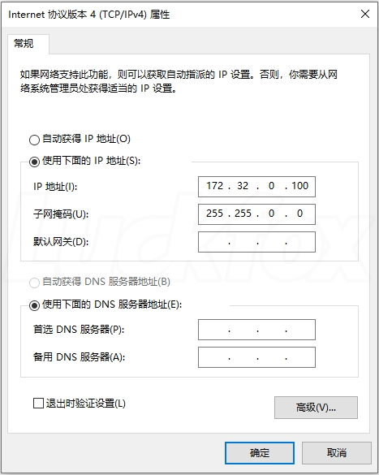

- [Luckfox-pico-max端侧部署RKNN](#luckfox-pico-max端侧部署rknn)
  - [烧写SDK镜像](#烧写sdk镜像)
    - [开始前注意事项](#开始前注意事项)
    - [安装驱动](#安装驱动)
    - [下载SDK](#下载sdk)
    - [烧录镜像](#烧录镜像)
  - [配置开发板虚拟网卡](#配置开发板虚拟网卡)
    - [准备工作](#准备工作)
  - [登录开发板](#登录开发板)
    - [ADB登录](#adb登录)
    - [SSH登录](#ssh登录)
  - [RKNN推理测试](#rknn推理测试)
    - [准备事项](#准备事项)
    - [模型转换](#模型转换)
      - [安装 YOLOV5](#安装-yolov5)
      - [PT 转 ONNX](#pt-转-onnx)
      - [安装 RKNN-ToolKit2](#安装-rknn-toolkit2)
      - [ONNX 转 RKNN](#onnx-转-rknn)
    - [交叉编译](#交叉编译)
      - [编译环境](#编译环境)
      - [交叉编译](#交叉编译-1)
    - [运行测试](#运行测试)
  - [自主开发的分类模型进行RKNN部署](#自主开发的分类模型进行rknn部署)
  - [LVGL示例测试快速使用](#lvgl示例测试快速使用)


# Luckfox-pico-max端侧部署RKNN

## 烧写SDK镜像

### 开始前注意事项
luckfox-pico进行开发时我们要烧写SDK镜像到开发板上，这里一开始我烧写的是Ubuntu镜像，但是luckfox-pico的SDK交叉编译工具链为uclibc，Ubuntu使用的工具链是glibc，所以程序无法通用。
luckfox-pico使用Ubuntu系统镜像会导致RK提供的组件无法使用，如果想要完整使用板子的功能还是建议使用busybox。

### 安装驱动
1. 下载RK驱动助手 DriverAssitant[[戳我下载]](https://files.luckfox.com/wiki/Luckfox-Pico/Software/DriverAssitant_v5.12.zip)。
2. 打开RK驱动助手 DriverAssitant 安装 USB 驱动程序，此过程无需连接，安装完成后重启电脑。

### 下载SDK
luckfoxpico为用户提供了适配 LuckFox Pico 和 LuckFox Pico Mini A 的 SD 卡固件以及 LuckFox Pico Mini B 和 LuckFox Pico Plus/Pro/Max 的 SPI FLASH 固件。
[LuckFox Pico / LuckFox Pico Mini A/B / LuckFox Pico Plus/Pro/Max 固件下载](https://pan.baidu.com/s/1Mhf5JMpkFuZo_TuaGSxBYg?pwd=2sf8#list/path=%2F)

### 烧录镜像

1. 下载和解压烧录工具(戳我下载)。
2. LuckFox Pico Pro/Max开发板就选择 RV1106。
3. 擦除 SPI FLASH  
    
4. LuckFox Pico Mini B/Plus/Pro/Max 在 Windows下载固件库方法:
① 按住 BOOT 键后连接电脑后，松开 BOOT 键，瑞芯微刷机工具就会显示 MaskRom 设备。
② 加载固件的存放目录，重载 env 文件，勾选所有项。
③ 点击下载。（注意：下载文件不包括update.img）  
    

## 配置开发板虚拟网卡
### 准备工作
LuckFox Pico 、LuckFox Pico Mini A/B 和 LuckFox Pico Plus/Pro/Max 的 USB 虚拟网卡具有静态 IP 地址为172.32.0.93。在使用之前，需要设置RNDIS虚拟网口。对于 LuckFox Pico Plus/Pro/Max 开发板，使用网口则无需进行配置。

1. Windows 安全中心—>防火墙和网络保护—>关闭防火墙。    


2. 配置 RNDIS 网卡的静态IP，打开设置—>高级网络设置—>更改适配器选项。  

3. 网卡一般是类似这样的名字Remote NDIS based nternet Sharing Device，右键属性。  


4. 双击 internet 协议版本（TCP/IPv4），IPV4地址设置为 172.32.0.100，避免和设备地址冲突。  
  


## 登录开发板

### ADB登录
暂时先不更新

### SSH登录
Luckfox Pico 系列的最新固件默认启用了 SSH。由于 Luckfox Pico 和 Luckfox Pico Mini A/B 没有网口，只能通过 USB 连接使用静态 IP 进行登录。而 LuckFox Pico Plus/Pro/Max 则可以使用网口分配的 IP 地址进行登录。

- Buildroot
    ```
    登录账号：root
    登录密码：luckfox
    静态IP地址：172.32.0.93
    ```
- Ubuntu
    ```
    登录账号：pico
    登录密码：luckfox
    静态IP地址：172.32.0.70
    ```

我们烧写的是buildroot，所以我们在终端输入：
```
ssh root@172.32.0.93
```

输入密码就可以登录啦！（下面是登录进去的样子）  


## RKNN推理测试

接下来我们要开始正式的端侧部署了，首先我们需要准备一台调试机，我这边使用的WSL下的Ubuntu 22.04。

### 准备事项
本次测试使用了 rknn_model_zoo/examples/yolov5 目录下的例程，这些例程交叉编译后可在 LuckFox Pico Max 开发板运行。运行例程所需的 rknn 图像识别模型由 pt 转 onnx 再到 rknn。参考链接：

Luckfox Pico SDK：https://github.com/LuckfoxTECH/luckfox-pico
YOLOV5：https://github.com/airockchip/yolov5
RKNN Toolkit2：https://github.com/rockchip-linux/rknn-toolkit2
RKNN Model Zoo：https://github.com/airockchip/rknn_model_zoo

### 模型转换

#### 安装 YOLOV5
```
git clone https://github.com/airockchip/yolov5.git
cd yolov5
pip3 install -r requirements.txt -i https://pypi.tuna.tsinghua.edu.cn/simple
```
#### PT 转 ONNX
```
pip3 install onnx -i https://pypi.tuna.tsinghua.edu.cn/simple
python3 export.py --rknpu --weight yolov5s.pt
```
- 我在进行`python3 export.py --rknpu --weight yolov5s.pt`开始报错，都是关于没有正确导入一些包，我们根据他的提示，利用pip进行安装即可

- 如果出现`ImportError: libGL.so.1: cannot open shared object file: No such file or directory`
    解决办法：
    ```
    pip install opencv-python-headless
    ```

#### 安装 RKNN-ToolKit2
- 环境要求
  - Ubuntu18.04(x64) --> python 3.6/3.7
  - Ubuntu20.04(x64) --> python 3.8/3.9
  - Ubuntu22.04(x64) --> python 3.10/3.11
- 下载rknn-toolkit2
    ```
    git clone https://github.com/rockchip-linux/rknn-toolkit2
    ```
    执行这一步你可能会出现以下报错  
    
    ```
    Cloning into 'rknn-toolkit2'...
    remote: Enumerating objects: 1734, done.
    remote: Counting objects: 100% (1734/1734), done.
    remote: Compressing objects: 100% (1096/1096), done.
    error: RPC failed; curl 56 GnuTLS recv error (-9): Error decoding the received TLS packet.
    error: 1724 bytes of body are still expected
    fetch-pack: unexpected disconnect while reading sideband packet
    fatal: early EOF
    fatal: fetch-pack: invalid index-pack output
    ```
    解决办法：
    ```
    设置git最低速度
    $ git config --global http.lowSpeedLimit 0
    $ git config --global http.lowSpeedTime 999999
    设置http缓存
    $ git config --global http.postBuffer 1048576000
    其中，postBuffer是用于设置Http缓存，可以设置的大一些，比如1G：git config --global http.postBuffer 1048576000，或者3G 3194304000
    ```
    如果还是不可以可以使用以下命令拉取最后一次提交
    ```
    git clone --depth 1 https://github.com/rockchip-linux/rknn-toolkit2
    ```
    拉取最后一次提交

- 安装python环境
    ```
    sudo apt-get update
    sudo apt-get install python3 python3-dev python3-pip
    sudo apt-get install libxslt1-dev zlib1g zlib1g-dev libglib2.0-0 libsm6 libgl1-mesa-glx libprotobuf-dev gcc
    ``` 
- 安装RKNN-ToolKit2依赖包
    ```
    pip3 install -r rknn-toolkit2/packages/requirements_cpxx-1.6.0.txt

    # such as: 
    pip3 install -r rknn-toolkit2/packages/requirements_cp310-1.6.0.txt
    ```
    根据不同的Python版本，选择安装对应的依赖包：
    | Python版本      | RKNN-Toolkit2依赖包 |
    | ----------- | ----------- |
    | 3.6      | requirements_cp36-1.6.0.txt       |
    | 3.7   | requirements_cp37-1.6.0.txt        |
    | 3.8      | requirements_cp38-1.6.0.txt       |
    | 3.9   | requirements_cp39-1.6.0.txt        |
    | 3.10      | requirements_cp310-1.6.0.txt       |
    | 3.11   | requirements_cp311-1.6.0.txt        |

    - 在安装RKNN-ToolKit2依赖包时，你可能出现troch与torchvision版本不匹配的报错，这时不要惊慌，我们安装trouch对应的torchvision版本就可以了  
     
    解决办法：
        ```
        pip install torchvision==0.14.1
        ```
    这里可以参考Liekkas Kono写的这一篇博文[PyTorch中torch、torchvision、torchaudio、torchtext版本对应关系](https://blog.csdn.net/shiwanghualuo/article/details/122860521)
- 安装RKNN-ToolKit2
    ```
    pip3 install rknn-toolkit2/packages/rknn_toolkit2-x.x.x+xxxxxxxx-cpxx-cpxx-linux_x86_64.whl

    # such as: 
    pip3 install rknn-toolkit2/packages/rknn_toolkit2-1.6.0+81f21f4d-cp310-cp310-linux_x86_64.whl
    ``` 
    包名格式为：rknn_toolkit2-{版本号}+{commit 号}-cp{Python 版本}-cp{Python 版本}-linux_x86_64.whl，根据不同的Python版本，选择安装对应的安装包：
    | Python版本      | RKNN-Toolkit2安装包 |
    | ----------- | ----------- |
    | 3.6      | rknn_toolkit2-{版本号}+{commit 号}-cp36-cp36m-linux_x86_64.whl       |
    | 3.7   | rknn_toolkit2-{版本号}+{commit 号}-cp36-cp37m-linux_x86_64.whl        |
    | 3.8      | rknn_toolkit2-{版本号}+{commit 号}-cp36-cp38m-linux_x86_64.whl       |
    | 3.9   | rknn_toolkit2-{版本号}+{commit 号}-cp36-cp39m-linux_x86_64.whl        |
    | 3.10      | rknn_toolkit2-{版本号}+{commit 号}-cp36-cp310m-linux_x86_64.whl       |
    | 3.11   | rknn_toolkit2-{版本号}+{commit 号}-cp36-cp311m-linux_x86_64.whl        |

    若执行以下命令没有报错，则安装成功：
    ```
    python3
    from rknn.api import RKNN
    ```

#### ONNX 转 RKNN
- 下载 rknn_model_zoo
    ```
    git clone https://github.com/airockchip/rknn_model_zoo.git
    ``` 
- 将刚刚得到的ONNX模型文件拷贝至 `rknn_model_zoo/examples/yolov5/model` 目录
    ```
    cp yolov5/yolov5s.onnx rknn_model_zoo/examples/yolov5/model
    ``` 
- 执行 `rknn_model_zoo/examples/yolov5/python` 目录下的模型转换程序 `convert.py`，使用方法：
    ```
    python3 convert.py <onnx_model> <TARGET_PLATFORM> <dtype(optional)> <output_rknn_path(optional)>

    # such as: 
    python3 convert.py ../model/yolov5s.onnx rv1106
    # output model will be saved as ../model/yolov5.rknn
    ``` 
    参数介绍：
    - `<onnx_model>`：ONNX 模型路径。
    - `<TARGET_PLATFORM>`：指定NPU平台名称。例如“rv1106”。
    - `<quant_dtype>` ：可选项，可以指定为i8或fp。i8表示进行量化，fp表示不量化，默认为i8。
    - `<output_rknn_path>`：可选项，用于指定 RKNN 模型的保存路径，默认保存在 ONNX 模型同一目录下，名称为 'yolov5.rknn'

### 交叉编译

#### 编译环境
成功将 ONNX 模型转换成 RKNN 模型后，现在对 `rknn_model_zoo/examples/yolov5` 目录下的例程进行交叉编译，编译例程前需要设置如下环境变量：
```
export GCC_COMPILER=<SDK目录>/tools/linux/toolchain/arm-rockchip830-linux-uclibcgnueabihf/bin/arm-rockchip830-linux-uclibcgnueabihf
```

#### 交叉编译
然后执行 rknn_model_zoo 目录下的 build-linux.sh 脚本。该脚本将编译例程：
```
chmod +x ./build-linux.sh
./build-linux.sh -t rv1106 -a armv7l -d yolov5
```
- 如果执行`./build-linux.sh -t rv1106 -a armv7l -d yolov5` 报错，无法编译，检查一下前面的SDK目录路径是否有错，我这里演示一下会报错的路径
    ```
    export GCC_COMPILER=home/user/luckfox-pico/tools/linux/toolchain/...
    ```
    正确路径
    ```
    export GCC_COMPILER=~/luckfox-pico/tools/linux/toolchain/...
    ```
- 编译过程    


- 交叉编译完成后在 rknn_model_zoo 目录下会生成一个 install 目录，包含编译出来的程序和库文件。
    ```
    root@c4f9d1f3042b:/home/rknn_model_zoo/install/rv1106_linux_armv7l/rknn_yolov5_demo
    # ls
    lib  model  rknn_yolov5_demo
    ``` 

### 运行测试
- 先将整个 rknn_yolov5_demo 目录传输至开发板
  - 这里我是将生成的文件打包成zip，通过scp传输到开发板上
      ```
      scp rknn_yolov5_demo.zip root@172.32.0.93:/root
      ```
  - 用unzip解压
      ```
      unzip rknn_yolov5_demo.zip
      ``` 
- 然后执行下面指令运行程序：
    ```
    cd /root/rknn_yolov5_demo/
    chmod 777 rknn_yolov5_demo
    ./rknn_yolov5_demo model/yolov5.rknn model/bus.jpg
    ``` 
- 推理完成后生成图片 out.png
    ```
    # ls
    lib               model             out.png           rknn_yolov5_demo
    ``` 
- 查看结果
  - 开发板如果还没有将屏幕弄好，无法显示图像，这边我是将图像下载到电脑上面进行查看
  - 利用adb的文件下载功能
    - 先将开发板连接到电脑
        ```
        adb connect 172.32.0.93
        ``` 
    - 下载文件
        ```
        adb -s 172.32.0.93:5555 pull /root/out.png
        ``` 
        接下来查看就好啦！

## 自主开发的分类模型进行RKNN部署


## LVGL示例测试快速使用

这边我是通过幸狐WIKI的LVGL快速使用进行的简单测试，设备树还没有更改，镜像没有自己编译出来，先用官方给的固件，其实为了使用适配屏，我觉得直接使用官方给的固件就可以了，我们学习后面的lvgl的移植就行。  
其实你要是只是想用的话，直接将官方给我们的压缩包。将lvgl_demo放到调试机上面交叉编译就行  
我将下载的镜像烧录到板子上，通过scp将demo可执行文件传到开发板里，运行就可以。

